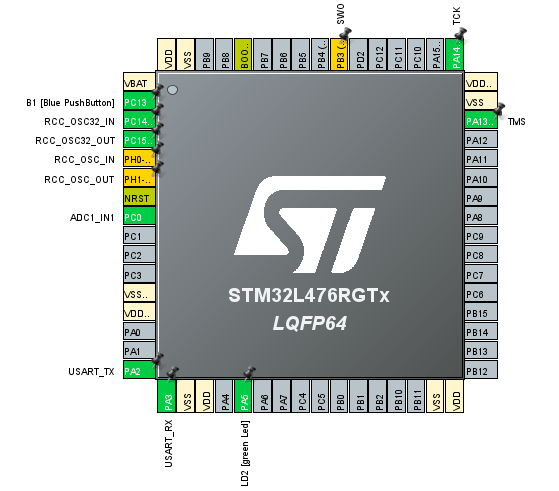

__SLIKA PINOUT__

__SLIKA VEZJA__

__ODGOVORI NA VPRAŠANJA__

__b)__ 3 ADC pretvorniki

__c)__ PC0

__d)__ ADC1_IN1

__e)__ S spremembo  APB1 peripheral clock na 16, se zraven spremenijo tudi vse ostale vrednosti

__g)__ 4MHz

__i)__ Pravi čas vzorčenja traja 65us

__KOMENTAR__
naloga je bila dovolj preprosta, deluje kot mora, samo malo zoprno je obračati te potenciometre. 
